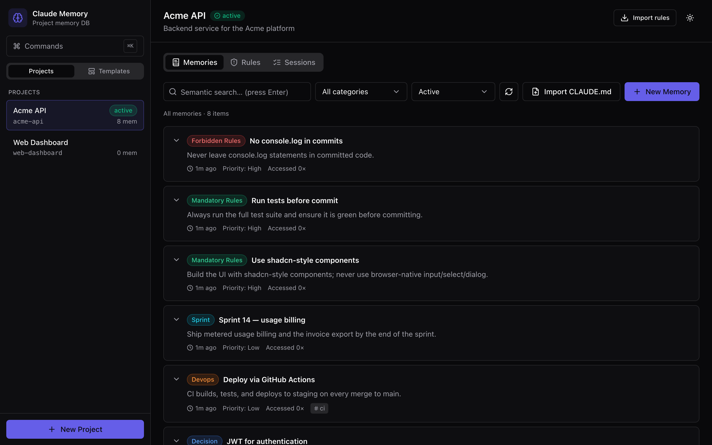
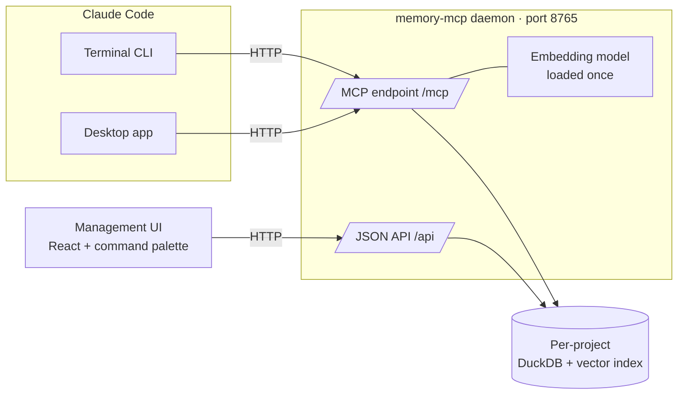
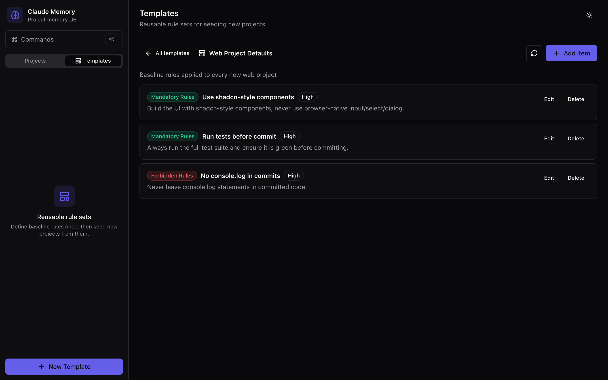
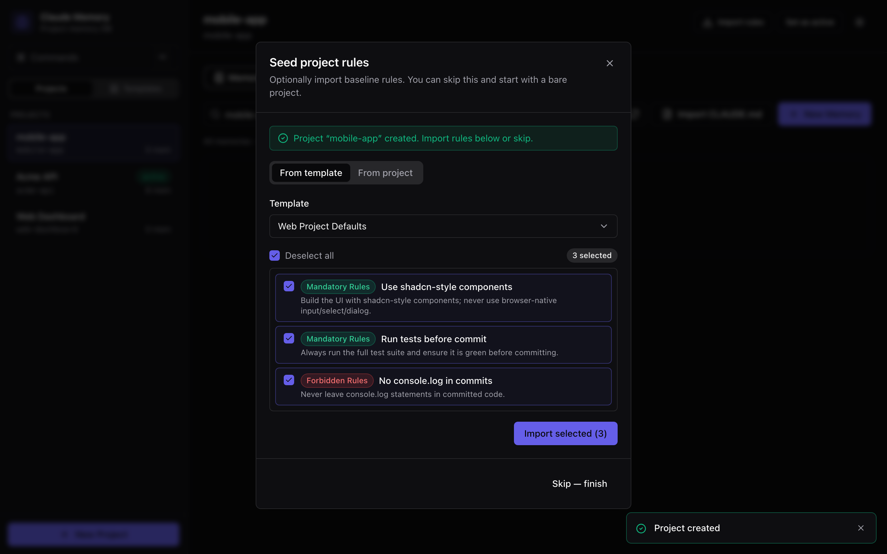

# Claude Memory MCP

**Persistent, searchable, per-project memory for Claude Code.**

[](https://github.com/navid-kianfar/claude-memory-mcp/actions/workflows/ci.yml)
[](LICENSE)
[](https://hub.docker.com/r/kianfar/claude-memory-mcp)

Claude forgets everything between sessions. You re-explain the same decisions,
rules get missed, and context is lost when the window fills up. Claude Memory
MCP gives each of your projects its own brain — decisions, rules, architecture
notes, and sprint goals stored locally in a vector database, retrieved by
meaning, and automatically loaded every time you start a session.



---

## What you get

- **Per-project memory** — each project has an isolated DuckDB database; memory
  never leaks between projects.
- **Semantic search** — ask "what database did we pick?" and it finds the
  Postgres decision even if you never typed "Postgres".
- **Rule enforcement** — mandatory/forbidden rules are re-injected into Claude's
  context every turn (via hooks) so they survive context compaction and stop
  being forgotten.
- **A management UI** — a React app to browse, search, and edit every project's
  memories, rules, sessions, and history, with a `Cmd+K` command palette.
- **One shared daemon** — a single background process serves the MCP endpoint
  and the UI; the embedding model loads once, and there are no database lock
  conflicts between clients.
- **Templates** — define a set of default rules once, then seed every new
  project from it (pick exactly which rules with checkboxes) instead of
  re-typing them. New projects can also import selected rules from any
  existing project.
- **CLAUDE.md import** — convert an existing `CLAUDE.md` into structured memory.
- **Portable & team-shareable** — move a project's database into the repo,
  commit it, and teammates get the same memory after `git pull`.

## How it works



Both Claude Code clients and the UI connect to the **same daemon**, which is the
sole owner of the DuckDB files. A `UserPromptSubmit` hook asks the daemon for
the current project's rules and injects them into context on every turn.

## Quick start — Docker (recommended)

```bash
docker run -d --name memory-mcp \
  -p 8765:8765 \
  -v memory-mcp-data:/data \
  kianfar/claude-memory-mcp:latest
```

Or with Compose:

```bash
docker compose up -d
```

Then:

- **Management UI** — open <http://localhost:8765/>
- **Connect Claude Code** — register the MCP server:

  ```bash
  claude mcp add --transport http memory http://localhost:8765/mcp
  ```

## Quick start — Homebrew

```bash
brew tap navid-kianfar/tap
brew install claude-memory-mcp
brew services start claude-memory-mcp        # runs the daemon in the background
```

Then `claude mcp add --transport http memory http://localhost:8765/mcp`. See
[packaging/homebrew/](packaging/homebrew/) for tap setup details.

## Quick start — from source

Requires [`uv`](https://docs.astral.sh/uv/) and (for the UI) Node 20+.

```bash
git clone https://github.com/navid-kianfar/claude-memory-mcp.git
cd claude-memory-mcp
./install.sh
```

`install.sh` installs dependencies, builds the UI, downloads the embedding
model, installs a launchd agent so the daemon auto-starts, points Claude Code at
the daemon, and installs the rule-enforcement hooks. It prints a one-time
`sudo` command to add a `claude-memory-mcp` entry to `/etc/hosts` so the UI URL
resolves — after that the UI is at <http://claude-memory-mcp:8765/>.

## Screenshots

Once the daemon is running, the management UI is at
<http://localhost:8765/> — browse, search, and edit every project's memories,
rules, and sessions.

**Templates** — define a baseline rule set once, then reuse it for every new
project:



**Seed a new project** — on creation, import exactly the rules you want (with
checkboxes) from a template or from another existing project:



## Using it

Inside Claude Code:

```text
memory_init_project("my-app", "My App")   # create a project
memory_session_start("my-app")            # loads rules + context
```

From then on Claude stores decisions, rules, and sprint notes automatically and
recalls them with semantic search. At the start of each session it loads the
project's rules, last summary, and recent decisions.

### Rule enforcement

Rules you set (`mandatory_rules` / `forbidden_rules`) are enforced three ways:

1. **Hook injection** — a `UserPromptSubmit` hook injects the actual rule text
   into context every turn, so rules survive context compaction.
2. **Server instructions** — the MCP server tells Claude to load and honor rules.
3. **Tool responses** — search/store responses carry a compact rules reminder.

Hooks are silent in directories that are not registered memory projects, so
they can be installed globally without noise.

### Importing an existing CLAUDE.md

```text
memory_import_claude_md("/path/to/project")            # import into memory
memory_import_claude_md("/path/to/project", stub_rewrite=True)  # + slim the file
```

Headings are mapped to categories (rules, architecture, decisions, devops,
docs); rule sections are split per bullet. With `stub_rewrite`, `CLAUDE.md` is
replaced by a short pointer at memory MCP (the original is backed up).

## The management UI

A React single-page app served by the daemon at `/`:

- Browse, search, create, edit, and archive memories in every category
- Manage mandatory/forbidden rules
- Inspect sessions and per-memory provenance/history
- Switch and set the active project
- `Cmd+K` command palette for fast navigation and actions

## MCP tools

33 tools, including:

| Area | Tools |
|------|-------|
| Projects | `memory_init_project`, `memory_list_projects`, `memory_project_info`, `memory_use` |
| Memories | `memory_store`, `memory_search`, `memory_recall`, `memory_update`, `memory_delete`, `memory_list` |
| Rules | `memory_get_rules`, `memory_add_rule`, `memory_update_rule`, `memory_delete_rule` |
| Templates | `memory_list_templates`, `memory_create_template`, `memory_add_template_rule`, `memory_apply_template`, `memory_import_rules` |
| Sessions | `memory_session_start`, `memory_session_end` |
| Portability | `memory_attach_project`, `memory_make_portable`, `memory_sync` |
| Import/Export | `memory_export`, `memory_import`, `memory_import_claude_md` |
| Model | `memory_model_info`, `memory_set_model`, `memory_reembed` |
| Misc | `memory_provenance`, `memory_version`, `memory_check_update` |

## Configuration

Environment variables (prefix `MEMORY_MCP_`):

| Variable | Default | Purpose |
|----------|---------|---------|
| `MEMORY_MCP_DATA_DIR` | `~/.memory-mcp` | Where databases are stored |
| `MEMORY_MCP_DAEMON_HOST` | `127.0.0.1` | Daemon bind address (`0.0.0.0` in Docker) |
| `MEMORY_MCP_DAEMON_PORT` | `8765` | Daemon port |
| `MEMORY_MCP_DAEMON_HOSTNAME` | `claude-memory-mcp` | Hostname used in the UI URL |

## Team / portable memory

Move a project's database into the repo so it can be committed and shared:

```text
memory_make_portable("/path/to/project")   # DB -> <repo>/.memory-mcp.duckdb
```

Commit `.memory-mcp.duckdb`. Teammates run `memory_sync("/path/to/project")`
after pulling and inherit the full project memory. Each project's database is
separate — sharing one never exposes the others.

## Architecture

- **Python + FastMCP** — the MCP server and HTTP daemon (Starlette + uvicorn)
- **DuckDB + VSS** — per-project memory storage with an HNSW cosine vector index
- **SQLite** — the local registry (project list + app settings); stdlib, no extra dependency
- **sentence-transformers** — local embeddings (`all-MiniLM-L6-v2`, 384-dim;
  a 50+ language multilingual preset is also available)
- **Layered design** — repositories → services → container → tool/HTTP layer
- **React + Vite + Tailwind** — the management UI, with hand-built
  shadcn-style components

Existing databases are migrated automatically on open, so older project
databases keep working after upgrades.

## Development

```bash
uv sync --all-extras
uv run pytest -v          # backend tests

cd frontend
npm install
npm run dev               # UI dev server (proxies the API to the daemon)
npm run build             # production build into frontend/dist
```

Run the daemon directly:

```bash
uv run memory-mcp serve
```

## License

MIT — see [LICENSE](LICENSE).
