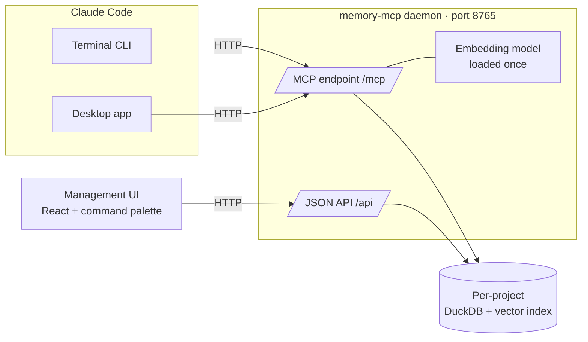

# Claude Memory MCP

**Claude Code forgets everything between sessions. This gives it a brain, a
backlog, and a team.**

[](https://github.com/navid-kianfar/claude-memory-mcp/actions/workflows/ci.yml)
[](LICENSE)
[](https://hub.docker.com/r/kianfar/claude-memory-mcp)

One local daemon, three things:

| | |
|---|---|
| 🧠 **Memory for Claude** | Decisions, rules and architecture notes per project — searched by meaning, reloaded every session, re-injected every turn. |
| ✅ **Task management** | A real backlog with states, sub-tasks, comments and a stopwatch — parked mid-session, mirrored to a live board. |
| 👥 **AI team management** | Twelve specialised agents on one shared contract, so the lead session delegates instead of doing everything itself. |

Everything is local: your own DuckDB files, your own embedding model, nothing
leaving the machine.


---

## Quick start

**1. Run the daemon.** Pick one:

<details open>
<summary><b>Docker</b> (recommended)</summary>

```bash
docker run -d --name memory-mcp \
  -p 8765:8765 \
  -v memory-mcp-data:/data \
  kianfar/claude-memory-mcp:latest
```

Or `docker compose up -d`.
</details>

<details>
<summary><b>Homebrew</b></summary>

```bash
brew tap navid-kianfar/tap
brew install claude-memory-mcp
brew services start claude-memory-mcp
```

See [packaging/homebrew/](packaging/homebrew/) for tap setup details.
</details>

<details>
<summary><b>From source</b> — the full install, including the agent team</summary>

Requires [`uv`](https://docs.astral.sh/uv/) and (for the UI) Node 20+.

```bash
git clone https://github.com/navid-kianfar/claude-memory-mcp.git
cd claude-memory-mcp
./install.sh
```

`install.sh` installs dependencies, builds the UI, downloads the embedding
model, installs a launchd agent so the daemon auto-starts, points Claude Code at
the daemon, installs the rule-enforcement hooks, and installs the twelve agents.
It prints a one-time `sudo` command to add a `claude-memory-mcp` entry to
`/etc/hosts` so the UI resolves at <http://claude-memory-mcp:8765/>.
</details>

**2. Connect Claude Code:**

```bash
claude mcp add --transport http memory http://localhost:8765/mcp
```

**3. Open the UI** at <http://localhost:8765/> and create a project — or do it
from Claude:

```text
memory_init_project("my-app", "My App")   # create a project
memory_session_start("my-app")            # loads rules, tasks, last summary
```

**4. Use it.** From here Claude stores decisions and rules as they are made, and
recalls them by meaning:

```text
"Always use pnpm, never npm"              -> memory_add_rule(...)  a mandatory rule
"We're going with Postgres because ..."   -> memory_store(...)     a decision
"What database did we pick?"              -> memory_search(...)    finds it next month
"Add a task to rewrite the CSV exporter"  -> memory_task_add(...)  queued, not started
```

Every later session starts by loading that project's rules, open tasks, last
summary and recent decisions. Nothing to re-explain.

### How it fits together


```mermaid
flowchart LR
  subgraph clients[Claude Code]
    CLI[Terminal CLI]
    APP[Desktop app]
  end
  UI[Management UI<br/>React + command palette]
  subgraph daemon[memory-mcp daemon · port 8765]
    MCP[/MCP endpoint  /mcp/]
    API[/JSON API  /api/]
    EMB[Embedding model<br/>loaded once]
  end
  DB[(Per-project<br/>DuckDB + vector index)]

  CLI -->|HTTP| MCP
  APP -->|HTTP| MCP
  UI -->|HTTP| API
  MCP --> DB
  API --> DB
  MCP --- EMB
```

Both Claude Code clients and the UI talk to the **same daemon**, which is the
sole owner of the DuckDB files — the embedding model loads once, and there are
no database lock conflicts between clients.

---

# 🧠 Memory for Claude

Each project gets an isolated DuckDB database with an HNSW cosine vector index.
Memory never leaks between projects, and searching is semantic: ask *"what
database did we pick?"* and it finds the Postgres decision even if you never
typed "Postgres".

Memories are categorised — `decision`, `architecture`, `devops`, `feedback`,
`sprint`, `reference`, `developer_docs`, `project_plan` — and every one carries
provenance and edit history.

## Rules that actually stick

Rules you set (`mandatory_rules` / `forbidden_rules`) are enforced three ways,
because one is not enough:

1. **Hook injection** — a `UserPromptSubmit` hook injects the actual rule text
   into context *every turn*, so rules survive context compaction.
2. **Server instructions** — the MCP server tells Claude to load and honor rules.
3. **Tool responses** — search/store responses carry a compact rules reminder.

Hooks stay silent in directories that are not registered memory projects, so
they can be installed globally without noise.

## Templates and seeding a new project

Define a baseline rule set once, then start every new project from it — picking
exactly which rules with checkboxes — instead of retyping them.


A new project can also import selected rules from any *existing* project:


### Imported rules arrive pending, on purpose

Rules written for one project carry that project's specifics — its component
names, its paths, its stack. Copied verbatim into another project they read as
authoritative and quietly steer the agent wrong. So `memory_import_rules` (and
the UI's Import dialog) brings them in as **pending**:

- stored and visible in the **Pending** tab, but **not in force** — kept out of
  the injected rule block, out of search, out of session context, and out of the
  git snapshot;
- surfaced at the next `memory_session_start` with a brief telling the agent to
  rewrite each one for *this* codebase, and to **ask you** rather than guess when
  a rule cannot be translated without knowing something only you know;
- activated by `memory_adapt_pending(memory_id, title, content)` — which clears
  the flag, puts the rule in force from that moment on, and lets it sync — or
  dropped with `memory_discard_pending(memory_id, reason)`.

Pass `pending=False` to import text you already know is project-neutral.

## Import an existing CLAUDE.md

```text
memory_import_claude_md("/path/to/project")                     # import into memory
memory_import_claude_md("/path/to/project", stub_rewrite=True)  # + slim the file
```

Headings map to categories (rules, architecture, decisions, devops, docs); rule
sections are split per bullet. With `stub_rewrite`, `CLAUDE.md` is replaced by a
short pointer at memory MCP, and the original is backed up.

## Team and multi-device memory (git sync)

Bind a project to its source folder and its memory travels with the code —
across your devices and your teammates:

```text
memory_link_folder("/path/to/project")
```

You can also set the folder when creating a project: the New Project dialog has
a **Project folder** field, and `memory_load_from_folder` binds it automatically.

Once bound, the project's rules and decisions mirror to a committable
**`.claude-memory/`** snapshot in the project folder — one JSON file per
category, diff- and merge-friendly, no binary database and no embeddings. A
`git push` carries the latest memory; a teammate's `git pull` plus their next
session imports it back. Export runs at the end of each turn and import at
session start (both via hooks); the central database stays the daemon's fast
working copy.

Import is **safe by design**: it only adds new entries and applies edits that
are strictly newer. It never deletes, and never reverts a more recent local
change — removing a rule is always explicit. Each project's memory is separate,
so sharing one never exposes the others.

The snapshot's `manifest.json` carries a **`project_id`**, the project's stable
identity. Because it is committed with the code, moving or renaming the project
folder re-binds the existing project instead of registering a duplicate, and a
teammate's clone resolves to the same project on their machine.

> **If memory is not reaching the snapshot**, look at
> `~/.claude-memory-mcp/sync.log`. The hooks discard the sync command's stderr so
> it can never disturb a Claude turn, so every failure writes a dated traceback
> there instead. Export also warns when `.claude-memory/` is gitignored, since an
> ignored snapshot never reaches your teammates.

---

# ✅ Task management

A task is a **queued requirement, not an instruction**. That is the whole point:
you can record something mid-session without derailing the work in progress.

```text
memory_task_add("Rewrite the CSV exporter")   # queued; Claude keeps doing what it was doing
memory_task_list()                            # what is waiting, open work first
memory_task_start(task_id)                    # claims it, clocks on, moves it to in_progress
memory_task_update(task_id, state="blocked")  # stops the clock and says why
memory_task_done(task_id, note="shipped")     # closes it and stops the clock
```

`memory_session_start` returns the open tasks with a brief telling Claude to
**report them and start none of them** unless you ask. Work Claude notices but
is not doing goes in with `source="claude"`.

Tasks have states, priorities, labels, due dates, sub-tasks, comments,
attachments and a stopwatch, and they live in their own DuckDB tables — never in
the committed memory snapshot, however long the list grows.

**The clock is symmetric.** `memory_task_start` opens a time entry stamped with
the session that started it; every path that ends the work closes it — done, an
update to any state other than in_progress, stop, release, archive, and
`memory_session_end`, which reports any clock it had to stop for a session that
forgot. A lease a session never refreshed for an hour is swept at the next
session start, so a crashed session cannot leave a task clocking.

When several Claude sessions share one project, a task is taken by claiming it:
`memory_task_claim_next(session_id)` — which a session calls only when it has
finished what it was doing, never mid-task. The claim is a conditional UPDATE
whose rowcount decides the winner, held on a 30-minute lease that renews as the
task is worked on, and released by `memory_session_end`.

## Multi-part requests become tasks before they are worked

`memory_task_plan(request, tasks)` records a request with several separable
deliverables as an ordered set of tasks — your wording kept verbatim on each one
— which are then worked top-down. If the session ends after the first, the rest
are still in the queue rather than only in the transcript.

The boundary is one task per **deliverable**, not per step: a question, or a
single change described in several clauses, is not a plan. Fewer than 2 tasks is
rejected (that is `memory_task_add`), more than 20 is over the cap, and a task
with no description is refused — over-decomposition buries a board in rows
nobody would plan around.

## Evidence on a task

`memory_task_attach(task_id, path)` copies a file into the task store and mirrors
it to the remote task — a screenshot proving a fix, a failing log, a generated
report. Content-addressed, so the same file on two tasks is one blob; sent once,
because no platform gives an attachment an idempotency key.

## Mirror the list to a real board (asoode)

Mirror a project's task list onto an [asoode](https://app.asoode.com) board so
the work is visible outside the terminal. The endpoints default to the hosted
service, so on-premise is the only case that needs configuring.

The access token is stored **once per machine**, not per project — every project
that talks to the same asoode reuses it:

```bash
memory-mcp asoode set-pat                     # prompts; the input is not echoed
memory-mcp asoode check                       # prove it reaches the server
memory-mcp asoode boards                      # list boards you can attach to
memory-mcp asoode attach <slug> --ref <ref>   # link an EXISTING board
memory-mcp asoode link <slug>                 # CREATE a project + board
memory-mcp asoode import <slug>               # pull board tasks into the local list
memory-mcp asoode push <slug>                 # full reconciliation (rarely needed)
memory-mcp asoode open <slug>                 # open that board already signed in
```

Use `attach` when the boards already exist, which is the normal case — `link`
*creates* one, so running it on a set-up workspace adds a duplicate beside the
real boards.

These commands ask the **running daemon** to do the work rather than opening the
project database themselves. DuckDB allows one writer per file across processes
and the daemon holds that lock, so doing it in-process used to fail — and fail
*late*, after the remote calls had already gone out, leaving tasks on the board
the local store had no record of. With no daemon running they fall back to direct
access, and any other path that hits the lock says so and offers both ways out
instead of raising a DuckDB `IOException`.

The token lives in the local registry (`~/.claude-memory-mcp/registry.db`), never
in the committed `.claude-memory/` snapshot, and is never printed back — `status`
shows only a `prefix…last4` fingerprint. Pass `--api-url` to store one for a
second server.

`open` uses asoode's `/auth/token` deep link, which carries the token in the URL
**fragment** — never sent to the server, never in an access log, never leaked
through a `Referer`, and stripped from the address bar on arrival. The link goes
straight to the browser and is printed redacted; no HTTP route returns or
redirects to it, which would put the token in a response body or a `Location`
header.

### One project, many boards

**A project links to work packages, never to an asoode project.** asoode has no
route attaching a task to a project — `project → work package → list → task` is
the only path — so a monorepo links to *one board per app*:

```bash
memory-mcp asoode attach myrepo --ref myrepo:backend                 # the default
memory-mcp asoode attach myrepo --ref myrepo:frontend --not-default
```

`memory_task_add(title=..., target="myrepo:frontend")` names the board a task
belongs to; a task with no `target` routes to the **default** link. A wrong name
fails the create rather than landing on the wrong board.

### What crosses, and in which direction

**Out — everything, the moment it changes.** State (including
`memory_task_start` moving a card to In Progress), title, description, priority,
assignee (matched to a member by email, username or full name), labels, dates,
estimate, comments with their kind and author, attachments and their removal,
sub-task parents, archive, delete (the card is archived — asoode has no delete —
and a local tombstone stops it re-importing) and every closed time entry.

Each mutation queues to an outbox and flushes **off-thread**, so a local write
never waits on the network. A card the flusher creates gets every field the task
already has. An unreachable asoode is a delay, not a lost edit: an outage never
counts against a row, only a rejected call does, and a row is abandoned after
five of those so a poison row cannot loop forever repeating a side effect. A
nudge landing mid-flush makes it go round again; the daemon sweeps every linked
outbox on start and once a minute; a short-lived process waits for its own
mirrors before exiting.

**In — creates only.** The daemon holds a Socket.IO subscription, so a task added
on the board reaches the session within seconds. That is an optimisation, not a
correctness requirement: `reconcile` also runs after every mirror, so a dropped
socket degrades to polling. asoode replays nothing, so every connect (the first
one included — the daemon was deaf before it started) drains each linked outbox
and reconciles each linked project once, floored at five minutes so a flapping
socket cannot spend its life sweeping; the catch-up asks the change feed which
boards moved and advances its watermark only after every reconcile it covers
succeeded. `GET /api/asoode/socket` reports connection, events, reconciles,
catch-ups and suppressed echoes.

**A task that exists on both sides is left alone**, because resolving a two-sided
edit needs a conflict policy that has not been decided.
`memory_asoode_import` is the explicit path that *does* overwrite local title and
state. Say what each direction carries rather than calling the two sides "in
sync".

<details>
<summary>Two details worth knowing</summary>

**The socket needs a ticket, not the PAT.** asoode's gateway keeps no database
and verifies signed JWTs only, so the PAT is exchanged at
`POST /account/socket-token` on each connect. A raw PAT is accepted and then
dropped with `transport error`.

**Our own writes are not reacted to.** asoode broadcasts every change to every
member, deliberately does not exclude the actor, and drops the actor id before
the client sees it — so the payload cannot be used to tell. The writer records
what it wrote and the listener consults it: a push of 29 tasks now produces 29
suppressed echoes and **zero** board reads, where it used to cost seven.
</details>

### Binding a project makes its board the work queue

A bound project's `memory_session_start` returns the board's open tasks and a
brief telling the agent to **work** them one at a time — start (which claims,
clocks on and moves the card), comment as it goes, mark done or pause with the
reason (both stop the clock), next. An unbound project keeps the opposite
contract: its queued tasks are surfaced and never started, so parking a
requirement mid-session cannot derail the session. The loop binds the lead
session; a dispatched agent works the task it was briefed on.

The binding is the whole opt-in — nothing is configured per project. If the board
cannot be reached, the session still starts and is told to work the local list,
which is the same queue mirrored.

### On-premise

```bash
memory-mcp asoode set-url --api https://api.asoode.internal
```

The sibling `app.`/`socket.` URLs are derived when the host looks like
`api.<domain>`; otherwise pass `--app` and `--socket` too. `reset-url` returns to
the hosted defaults.

`link` and `push` are idempotent: the board carries the project's stable uid as
its `externalRef` and each task carries its local id, so asoode returns the
existing row instead of creating a duplicate. Re-running pushes changes.

### Other platforms

The bridge is provider-agnostic: `TaskProvider` (a Protocol), a registry that
resolves a link's `provider` column, per-(provider, account) credentials, and a
conformance suite any implementation must pass. asoode is the only provider
shipped, because an integration written from published docs and tested against a
fake written in this repo is not a verified integration.

---

# 👥 AI team management

`memory-mcp-setup` installs twelve specialised agents to `~/.claude/agents/`
from [`agents/`](agents/) — eight roles and four stack experts that extend a
role:

| Roles | Stack experts |
|---|---|
| `pm` · technical lead, breaks work down and integrates it | `dotnet` — solution layout, DI, services (before `backend`) |
| `backend` · APIs, services, data models, migrations | `nodejs` — NestJS for APIs/workers, Next.js for SSR, pnpm (before `backend`) |
| `frontend` · UI to the designer's spec, verified in a browser | `react` — pnpm + Vite + Tailwind + shadcn, every shadcn component wrapped once |
| `designer` · tokens, component specs, flows, visual review | `app` — Kotlin Multiplatform, Android and iOS pixel-identical |
| `test` · verifies work on the running product | |
| `reviewer` · independent review, reports and never fixes | |
| `devops` · CI, builds, deploys, monitoring | |
| `docs` · READMEs, API docs, changelogs, guides | |

**The session talking to you is the lead.** It orchestrates directly and
dispatches specialists; it never dispatches a `pm` to do that, because a
subagent's output is never shown to you and cannot be redirected once running.

Every definition `extends:` the shared base [`agents/_base.md`](agents/_base.md),
composed at install time, so the contract that makes the three modules complete
each other is stated once:

- **brain** — session start, the binding rules, search before deciding, store
  what outlives the task, `project=` on every write;
- **tasks** — start claims and clocks on, comment as you go, stop the clock on
  every finish, session end last, each with the agent's *own* `session_id`
  (subagents share the lead's MCP connection, so a borrowed id displaces it);
- **team** — cross-boundary changes are reported to the lead, not made; `test`
  verifies a change on the running product before it is committed.

A dispatch costs roughly 60k tokens at the floor, so the lead does one-file work
itself and delegates genuine specialisms or genuinely parallel work
(`frontend` and `backend` are worktree-isolated and can run at once).

See [`agents/README.md`](agents/README.md) for the composition rules and
[`docs/bridge/06-agent-team.md`](docs/bridge/06-agent-team.md) for the design and
what was verified by dispatch.

---

---

# 🖥️ The management UI

A React single-page app served by the daemon at `/`:

- Browse, search, create, edit and archive memories in every category
- Manage mandatory/forbidden rules, templates, and pending imported rules
- Work the task list: grouped by state, drag to reorder, inline add per group,
  and a task dialog with sub-tasks, comments, an activity trail and a stopwatch
- Inspect sessions and per-memory provenance/history
- Switch and set the active project
- `Cmd+K` command palette for fast navigation and actions

---

# Reference

## MCP tools

All 66 tools:

| Area | Tools |
|------|-------|
| Projects | `memory_init_project`, `memory_load_from_folder`, `memory_link_folder`, `memory_list_projects`, `memory_project_info`, `memory_rename_project`, `memory_use` |
| Memories | `memory_store`, `memory_search`, `memory_recall`, `memory_update`, `memory_delete`, `memory_list` |
| Rules | `memory_get_rules`, `memory_add_rule`, `memory_add_rule_bulk`, `memory_update_rule`, `memory_delete_rule` |
| Governance (server mode) | `memory_approve_rule`, `memory_revoke_rule` |
| Templates | `memory_list_templates`, `memory_create_template`, `memory_add_template_rule`, `memory_apply_template`, `memory_import_rules` |
| Imported rules | `memory_pending_list`, `memory_adapt_pending`, `memory_discard_pending` |
| Tasks | `memory_task_add`, `memory_task_list`, `memory_task_get`, `memory_task_update`, `memory_task_comment`, `memory_task_start`, `memory_task_stop`, `memory_task_done`, `memory_task_archive`, `memory_task_convert`, `memory_task_delete` |
| Task claims (multi-session) | `memory_task_claim_next`, `memory_task_release` |
| Planning | `memory_task_plan` |
| Sessions | `memory_session_start`, `memory_session_end` |
| Portability | `memory_attach_project`, `memory_make_portable`, `memory_sync` |
| Import/Export | `memory_export`, `memory_import`, `memory_import_claude_md` |
| Model | `memory_model_info`, `memory_set_model`, `memory_reembed` |
| asoode bridge | `memory_asoode_status`, `memory_asoode_boards`, `memory_asoode_attach`, `memory_asoode_link`, `memory_asoode_import`, `memory_asoode_reconcile`, `memory_asoode_push`, `memory_asoode_links` |
| Attachments | `memory_task_attach`, `memory_task_attachments` |
| Misc | `memory_provenance`, `memory_version`, `memory_check_update` |

## Command line

```bash
memory-mcp serve            # run the shared HTTP daemon (MCP + UI)
memory-mcp stdio            # run the MCP server over stdio (legacy / fallback)
memory-mcp setup            # interactive setup (hooks, agents, launchd, MCP)
memory-mcp update           # rebuild the runtime from source and reload the daemon
memory-mcp rules            # print the current project's rules (used by hooks)
memory-mcp sync ...         # export/import the memory snapshot (used by hooks)
memory-mcp asoode ...       # board endpoints and the machine-wide PAT
memory-mcp provider ...     # task platforms and their credentials
memory-mcp bind ...         # route a project to a local or remote backend
memory-mcp user ...         # server-mode users: create, list, rotate tokens
```

## Configuration

Environment variables (prefix `MEMORY_MCP_`):

| Variable | Default | Purpose |
|----------|---------|---------|
| `MEMORY_MCP_DATA_DIR` | `~/.claude-memory-mcp` | Where databases are stored |
| `MEMORY_MCP_DAEMON_HOST` | `127.0.0.1` | Daemon bind address (`0.0.0.0` in Docker) |
| `MEMORY_MCP_DAEMON_PORT` | `8765` | Daemon port |
| `MEMORY_MCP_DAEMON_HOSTNAME` | `claude-memory-mcp` | Hostname used in the UI URL |
| `MEMORY_MCP_ASOODE_API_URL` | `https://api.asoode.com` | asoode REST base (on-premise override) |
| `MEMORY_MCP_ASOODE_APP_URL` | `https://app.asoode.com` | asoode web app, for links |
| `MEMORY_MCP_ASOODE_SOCKET_URL` | `https://socket.asoode.com` | asoode realtime origin |

## Architecture

- **Python + FastMCP** — the MCP server and HTTP daemon (Starlette + uvicorn)
- **DuckDB + VSS** — per-project memory storage with an HNSW cosine vector index
- **SQLite** — the local registry (project list + app settings); stdlib, no extra dependency
- **sentence-transformers** — local embeddings (`all-MiniLM-L6-v2`, 384-dim;
  a 50+ language multilingual preset is also available)
- **Layered design** — repositories → services → container → tool/HTTP layer
- **React + Vite + Tailwind** — the management UI, with hand-built
  shadcn-style components

Tasks live in their own DuckDB tables (`tasks`, `task_comments`,
`task_time_entries`) rather than as a memory category — which is what keeps them
out of the git-committed `.claude-memory/` snapshot however long the list grows.

Existing databases are migrated automatically on open, so older project
databases keep working after upgrades.

## Development

```bash
uv sync --all-extras
uv run pytest -v          # backend tests

cd frontend
npm install
npm run dev               # UI dev server (proxies the API to the daemon)
npm run build             # production build into frontend/dist
```

Run the daemon directly with `uv run memory-mcp serve`.

## Releasing

The Docker image is published only for **tagged releases** — never on ordinary
commits. Cut a release with the helper script:

```bash
./scripts/release.sh           # patch bump (0.7.0 -> 0.7.1)
./scripts/release.sh minor     # 0.7.0 -> 0.8.0
./scripts/release.sh 1.2.3     # explicit version
```

It runs the tests, bumps the version in `pyproject.toml` and the package,
commits, creates a `vX.Y.Z` tag, and pushes. The tag push triggers the workflow
that builds and publishes the multi-arch image to Docker Hub.

## License

MIT — see [LICENSE](LICENSE).
